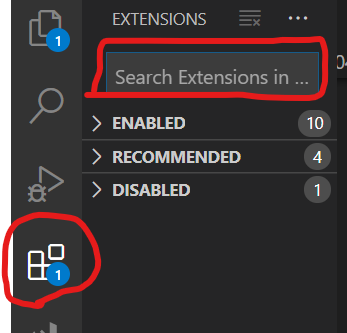
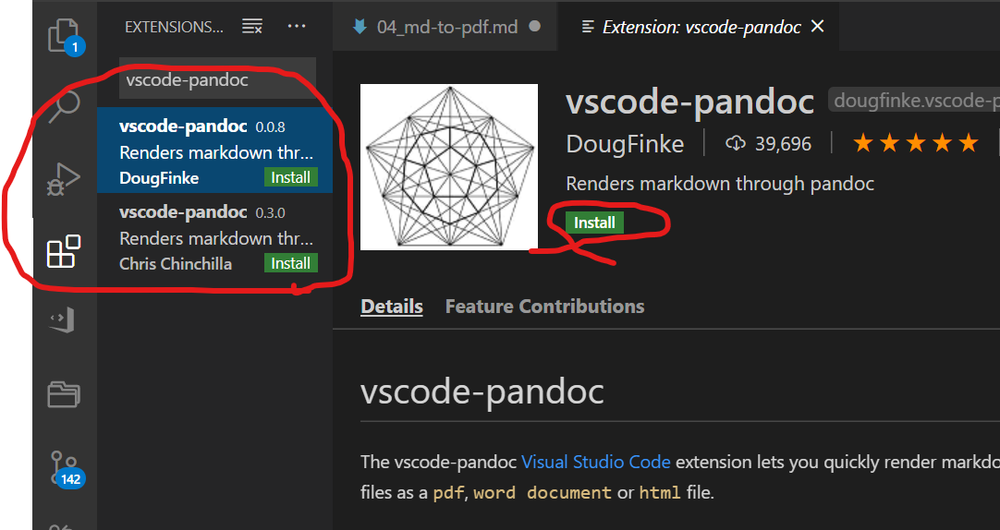

## 目次

はじめに  
準備  
手順  
完成  
おわりに  

## はじめに

対象読者は、次の3つを満たしている人を想定しています。

1. vscodeがインストール済み
2. Rstudioがインストール済み
3. markdownを書いたことがある

こんな感じの.mdから

個々に画像が入る

こんな感じのpdfが出せるようになります

ここに画像が入る  

## 目的

<font color="red">
vscodeでmarkdownを快適に編集して、日本語pdfを出力すること。
</font>

markdownの編集はvscodeでやると快適です。
なぜなら、markdownのプレビューを簡単に表示できるからです。
しかし、日本語pdfの出力がうまくいかなかったり、数式の出力ができなかったりする問題があります。
その問題を解消するために、pandocを使用します。

* pandoc markdown preview（必須）
  * shift + ctrl + r でビュー
  * front matter yaml も表示
* vscode-pandec（必須）
  + レンダリングに必要
* markdown all in one(補助)
  + いろいろサポート
* markdown preview enhanced（補助）
  * あってもなくてもよい、白プレビューが見れる
* markdown + math
  * 数式にゅりょくで補助（補助）

* pandocのイメージ
  * Rmdのやつサイトもってくる
* pandoc ユーザーズガイド
  * pandocの事で困ったらまずこれを見る
* マージンの設定。
  * front matter でいじるか、pandocの引数に入れる。


## 方法

1. Rstudioのpandocにpathを通す
2. vscodeの拡張機能をいろいろ追加する
3. front matter yamlの書き方
4. markdownの書き方を少々

### 1. Rstudioのpandocにpathを通す{#tejun_1}

<font color="red">
ココがこの記事でのキモです。
</font>
本来ならばpandocをインストールするところから始まりますが、ここではRstudioに組み込まれているpandocを使用します。

システムからRstudioのpandocへのpathは、自分で設定する必要があります。Rstudioのpandocは、以下のようにbinの下にあります。

```
~任意/Rstudio/bin/pandoc
```

pathが通ったかどうかの確認として、プロンプトで次のコマンドを入力してください。

```
pandoc --version
```

以下のようにpandocのバージョンが出力されたら、pathの設定は完了です。

```
pandoc 2.7.2
Compiled with pandoc-types 1.17.5.4, texmath 0.11.2.2, skylighting 0.7.7
Default user data directory: C:\Users\AkiyamaHiroki\AppData\Roaming\pandoc
Copyright (C) 2006-2019 John MacFarlane
Web:  http://pandoc.org
This is free software; see the source for copying conditions.
There is no warranty, not even for merchantability or fitness
for a particular purpose.
```

### 2. vscodeの拡張をいろいろ追加していく{#tejun_2}

vscodeで拡張を追加する方法と、追加するいくつかの拡張について説明します。

#### 拡張機能を追加する方法

vscodeの左端っこにある、テトリスみたいなアイコンを押します。アイコンをクリックしたら、検索欄で追加したい拡張機能を検索します。



まずはvscode-pandocと検索してみましょう。検索したら、vscode-pandoc のDougFinkeのやつをクリックします。(Chrisの方でもたぶん大丈夫です)




* 必須
  * pandoc markdown preview
  * vscode-pandec
* 補助
  * markdown all in one
  * markdown preview enhanced
  * markdown + math

#### pandoc markdown preview（必須）

これは

#### vscode-pandec（必須）
#### markdown all in one（補助）
#### markdown preview enhanced（補助）
#### markdown + math（補助）


### 3. front matter{#tejun_3}

aa

### 4. 書き方を少々{#tejun_4}

aa

## おわりに

aa