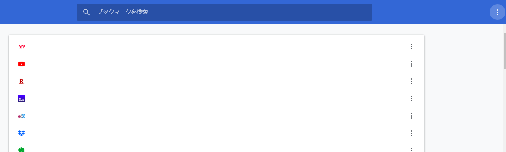
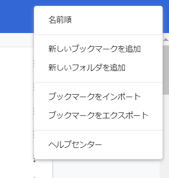

# bookmark編集

google accountのブックマークを整理するために使えるかもという感じの理由で書きました。

bookmarkの名前, url, 追加日付の3つをデータフレーム化できます。


chromeでctrl + shift + o を押して、bookmark編集画面を開く



こんな感じの画面が出る。

右上のてんてんてんを押す



ブックマークをエクスポートする。

任意の場所に保存する。

参考https://cfes-project.eco.u-toyama.ac.jp/wp-content/uploads/2017/04/3_scraping.html

```{r}
library(tidyverse)
library(rvest)
library(lubridate)
library(here)
```

```{r}
# エクスポートしたbookmark htmlを読み込む
html <- read_html(here("data/bookmarks_2020_06_04.html"))

# url
all_url <- html %>%
  html_nodes("a") %>%   # find all links  
  html_attr("href") %>% # pull out url
  as_tibble() %>% 
  rename(url = 1)

# bookmarkに登録してる名前
all_text <- html %>% 
  html_nodes("a") %>% 
  html_text() %>%     # pull out text
  as_tibble() %>% 
  rename(text = 1)


# 追加した日
all_add_date <- html %>% 
  html_nodes("a") %>% 
  html_attr("add_date") %>% # pull out date
  as_tibble() %>% 
  rename(add_date = 1)

# 3つをくっつけてデータフレーム化
d <- bind_cols(all_url, all_text, all_add_date)
d %>% glimpse()
```

追加した日付がunixタイムになってるから、日付に直す

```{r}
d2 <- d %>% 
  mutate(add_date = as.numeric(add_date),
         add_date = as.POSIXct(add_date, origin="1970-1-1")) %>% 
         # 追加時間はいらなくてymdだけで良い場合は下記も実行
  mutate(add_date = format(add_date, format="%Y/%m/%d")) %>% 
  mutate(add_date = as_date(add_date))
d2 %>% glimpse()
```

データフレーム化できたので、あとは適当に編集してやればmarkdownの埋め込みlinkも作れるし、scrapboxの埋め込みlinkにもできる。


ついでに簡単に集計して可視化してみる

```{r message=FALSE, warning=FALSE}
d3 <- d2 %>% 
  mutate(y = year(add_date),
         m = month(add_date),
         ym = paste(y, m)) 
d3 %>% 
  group_by(ym) %>%
  count() %>% 
  arrange(ym) %>% 
  DT::datatable(options = list(searchHighlight = TRUE), filter = 'top')

```


```{r}
d3 %>% 
  ggplot(aes(x = ym)) +
  geom_bar() +
  theme(axis.text.x = element_text(angle = 90, hjust = 1)) +
  labs(title = "bookmark追加件数　月ごと")
```

